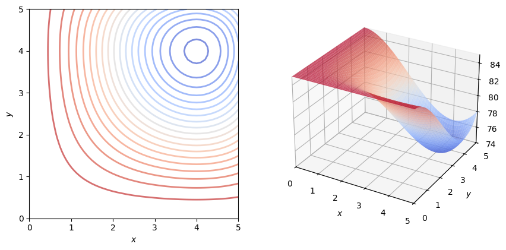
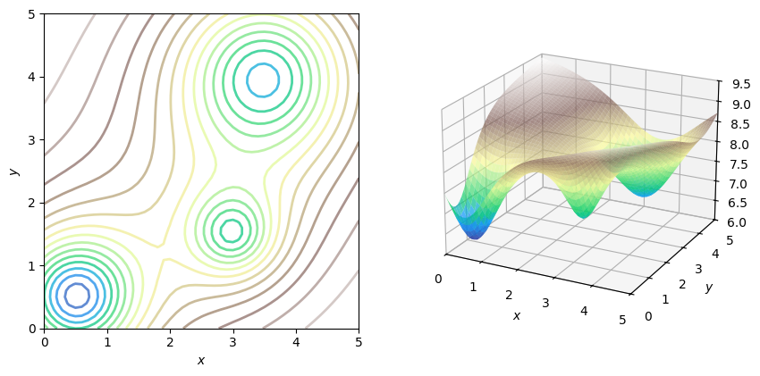

# Optimization Using Gradient Descent in Two Variables

In this lab, you will implement and visualize the gradient descent method optimizing some functions in two variables. You will have a chance to experiment with the initial parameters, and investigate the results and limitations of the method.

# Table of Contents

- [ 1 - Function with One Global Minimum](#1)
- [ 2 - Function with Multiple Minima](#2)

## Packages

Run the following cell to load the packages you'll need.


```python
import numpy as np
import matplotlib.pyplot as plt
# Some functions defined specifically for this notebook.
from w2_tools import (plot_f_cont_and_surf, gradient_descent_two_variables, 
                      f_example_3, dfdx_example_3, dfdy_example_3, 
                      f_example_4, dfdx_example_4, dfdy_example_4)
# Magic command to make matplotlib plots interactive.
%matplotlib widget
```


    ---------------------------------------------------------------------------

    RuntimeError                              Traceback (most recent call last)

    File ~/Projects/machine_learning_calculus_w2_lib/.venv/lib/python3.12/site-packages/matplotlib/backends/registry.py:407, in BackendRegistry.resolve_gui_or_backend(self, gui_or_backend)
        406 try:
    --> 407     return self.resolve_backend(gui_or_backend)
        408 except Exception:  # KeyError ?


    File ~/Projects/machine_learning_calculus_w2_lib/.venv/lib/python3.12/site-packages/matplotlib/backends/registry.py:369, in BackendRegistry.resolve_backend(self, backend)
        368 if gui is None:
    --> 369     raise RuntimeError(f"'{backend}' is not a recognised backend name")
        371 return backend, gui if gui != "headless" else None


    RuntimeError: 'widget' is not a recognised backend name

    
    During handling of the above exception, another exception occurred:


    RuntimeError                              Traceback (most recent call last)

    Cell In[1], line 8
          4 from w2_tools import (plot_f_cont_and_surf, gradient_descent_two_variables, 
          5                       f_example_3, dfdx_example_3, dfdy_example_3, 
          6                       f_example_4, dfdx_example_4, dfdy_example_4)
          7 # Magic command to make matplotlib plots interactive.
    ----> 8 get_ipython().run_line_magic('matplotlib', 'widget')


    File ~/Projects/machine_learning_calculus_w2_lib/.venv/lib/python3.12/site-packages/IPython/core/interactiveshell.py:2504, in InteractiveShell.run_line_magic(self, magic_name, line, _stack_depth)
       2502     kwargs['local_ns'] = self.get_local_scope(stack_depth)
       2503 with self.builtin_trap:
    -> 2504     result = fn(*args, **kwargs)
       2506 # The code below prevents the output from being displayed
       2507 # when using magics with decorator @output_can_be_silenced
       2508 # when the last Python token in the expression is a ';'.
       2509 if getattr(fn, magic.MAGIC_OUTPUT_CAN_BE_SILENCED, False):


    File ~/Projects/machine_learning_calculus_w2_lib/.venv/lib/python3.12/site-packages/IPython/core/magics/pylab.py:103, in PylabMagics.matplotlib(self, line)
         98     print(
         99         "Available matplotlib backends: %s"
        100         % _list_matplotlib_backends_and_gui_loops()
        101     )
        102 else:
    --> 103     gui, backend = self.shell.enable_matplotlib(args.gui)
        104     self._show_matplotlib_backend(args.gui, backend)


    File ~/Projects/machine_learning_calculus_w2_lib/.venv/lib/python3.12/site-packages/IPython/core/interactiveshell.py:3787, in InteractiveShell.enable_matplotlib(self, gui)
       3784     import matplotlib_inline.backend_inline
       3786 from IPython.core import pylabtools as pt
    -> 3787 gui, backend = pt.find_gui_and_backend(gui, self.pylab_gui_select)
       3789 if gui != None:
       3790     # If we have our first gui selection, store it
       3791     if self.pylab_gui_select is None:


    File ~/Projects/machine_learning_calculus_w2_lib/.venv/lib/python3.12/site-packages/IPython/core/pylabtools.py:349, in find_gui_and_backend(gui, gui_select)
        347 else:
        348     gui = _convert_gui_to_matplotlib(gui)
    --> 349     backend, gui = backend_registry.resolve_gui_or_backend(gui)
        351 gui = _convert_gui_from_matplotlib(gui)
        352 return gui, backend


    File ~/Projects/machine_learning_calculus_w2_lib/.venv/lib/python3.12/site-packages/matplotlib/backends/registry.py:409, in BackendRegistry.resolve_gui_or_backend(self, gui_or_backend)
        407     return self.resolve_backend(gui_or_backend)
        408 except Exception:  # KeyError ?
    --> 409     raise RuntimeError(
        410         f"'{gui_or_backend}' is not a recognised GUI loop or backend name")


    RuntimeError: 'widget' is not a recognised GUI loop or backend name


<a name='1'></a>
## 1 - Function with One Global Minimum

Let's explore a simple example of a function in two variables $f\left(x, y\right)$ with one global minimum. Such a function was discussed in the videos, it is predefined and uploaded into this notebook as `f_example_3` with its partial derivatives `dfdx_example_3` and `dfdy_example_3`. At this stage, you do not need to worry about the exact expression for that function and its partial derivatives, so you can focus on the implementation of gradient descent and the choice of the related parameters. Run the following cell to plot the function.


```python
plot_f_cont_and_surf([0, 5], [0, 5], [74, 85], f_example_3, cmap='coolwarm', view={'azim':-60,'elev':28})
```


    (<Figure size 1000x500 with 2 Axes>,
     <Axes: xlabel='$x$', ylabel='$y$'>,
     <Axes3D: xlabel='$x$', ylabel='$y$', zlabel='$f$'>)


    

    


To find the minimum, you can implement gradient descent starting from the initial point $\left(x_0, y_0\right)$ and making steps iteration by iteration using the following equations:


$$x_1 = x_0 - \alpha \frac{\partial f}{\partial x}(x_0, y_0),$$ 
$$y_1 = y_0 - \alpha \frac{\partial f}{\partial y}(x_0, y_0),\tag{1}$$

where $\alpha>0$ is a learning rate. Number of iterations is also a parameter. The method is implemented with the following code:


```python
def gradient_descent(dfdx, dfdy, x, y, learning_rate = 0.1, num_iterations = 100):
    for iteration in range(num_iterations):
        x, y = x - learning_rate * dfdx(x, y), y - learning_rate * dfdy(x, y)
    return x, y
```

Now to optimize the function, set up the parameters `num_iterations`, `learning_rate`, `x_initial`, `y_initial` and run gradient descent:


```python
num_iterations = 30; learning_rate = 0.25; x_initial = 0.5; y_initial = 0.6
print("Gradient descent result: x_min, y_min =", 
      gradient_descent(dfdx_example_3, dfdy_example_3, x_initial, y_initial, learning_rate, num_iterations)) 
```

    Gradient descent result: x_min, y_min = (4.0, 4.0)


You can see the visualization running the following code. Note that gradient descent in two variables performs steps on the plane, in a direction opposite to the gradient vector $\begin{bmatrix}\frac{\partial f}{\partial x}(x_0, y_0) \\ \frac{\partial f}{\partial y}(x_0, y_0)\end{bmatrix}$ with the learning rate $\alpha$ as a scaling factor.

By uncommenting different lines you can experiment with various sets of the parameter values and corresponding results. At the end of the animation, you can also click on the contour plot to choose the initial point and restart the animation automatically.

Run a few experiments and try to explain what is actually happening in each of the cases.


```python
num_iterations = 20; learning_rate = 0.25; x_initial = 0.5; y_initial = 0.6
# num_iterations = 20; learning_rate = 0.5; x_initial = 0.5; y_initial = 0.6
# num_iterations = 20; learning_rate = 0.15; x_initial = 0.5; y_initial = 0.6
# num_iterations = 20; learning_rate = 0.15; x_initial = 3.5; y_initial = 3.6

gd_example_3 = gradient_descent_two_variables([0, 5], [0, 5], [74, 85], 
                                              f_example_3, dfdx_example_3, dfdy_example_3, 
                                              gradient_descent, num_iterations, learning_rate, 
                                              x_initial, y_initial, 
                                              [0.1, 0.1, 81.5], 2, [4, 1, 171], 
                                              cmap='coolwarm', view={'azim':-60,'elev':28})
```


    

    


<a name='2'></a>
## 2 - Function with Multiple Minima

Let's investigate a more complicated case of a function, which was also shown in the videos:


```python
plot_f_cont_and_surf([0, 5], [0, 5], [6, 9.5], f_example_4, cmap='terrain', view={'azim':-63,'elev':21})
```


    (<Figure size 1000x500 with 2 Axes>,
     <Axes: xlabel='$x$', ylabel='$y$'>,
     <Axes3D: xlabel='$x$', ylabel='$y$', zlabel='$f$'>)


    

    


You can find its global minimum point by using gradient descent with the following parameters:


```python
num_iterations = 100; learning_rate = 0.2; x_initial = 0.5; y_initial = 3

print("Gradient descent result: x_min, y_min =", 
      gradient_descent(dfdx_example_4, dfdy_example_4, x_initial, y_initial, learning_rate, num_iterations)) 
```

    Gradient descent result: x_min, y_min = (0.5230322579358745, 0.5169891562802605)


However, the shape of the surface is much more complicated and not every initial point will bring you to the global minimum of this surface. Use the following code to explore various sets of parameters and the results of gradient descent.


```python
# Converges to the global minimum point.
num_iterations = 30; learning_rate = 0.2; x_initial = 0.5; y_initial = 3
# Converges to a local minimum point.
# num_iterations = 20; learning_rate = 0.2; x_initial = 2; y_initial = 3
# Converges to another local minimum point.
# num_iterations = 20; learning_rate = 0.2; x_initial = 4; y_initial = 0.5

gd_example_4 = gradient_descent_two_variables([0, 5], [0, 5], [6, 9.5], 
                                              f_example_4, dfdx_example_4, dfdy_example_4, 
                                              gradient_descent, num_iterations, learning_rate, 
                                              x_initial, y_initial, 
                                              [2, 2, 6], 0.5, [2, 1, 63], 
                                              cmap='terrain', view={'azim':-63,'elev':21})
```


    

    


You had a chance to experience the robustness and limitations of the gradient descent methods for a function in two variables. 


```python

```
